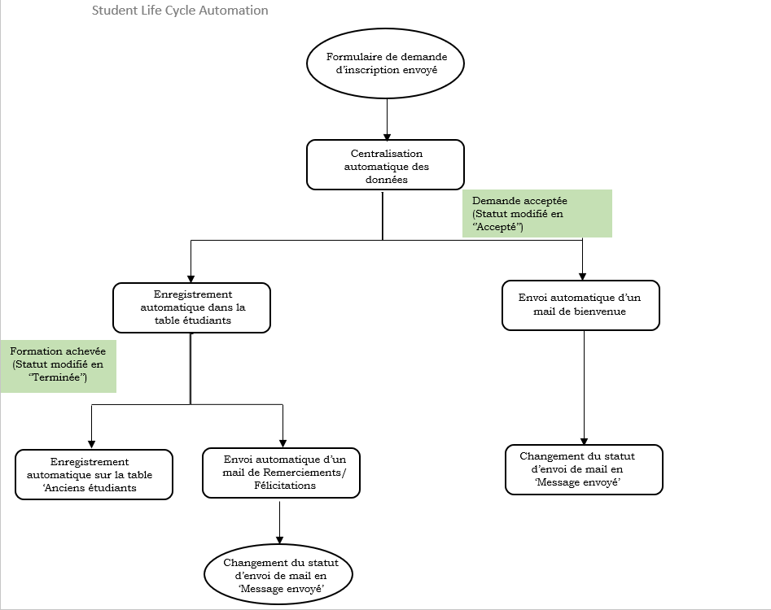
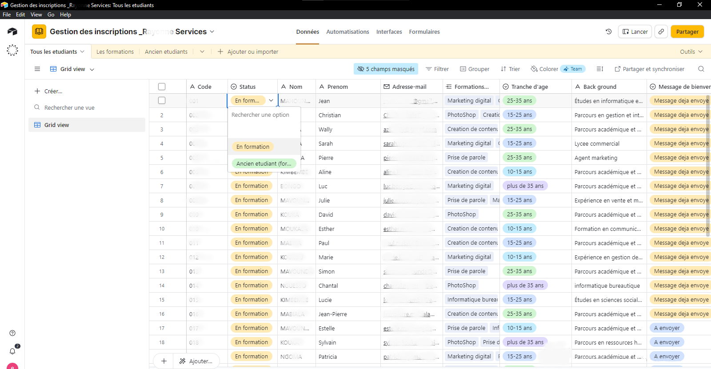
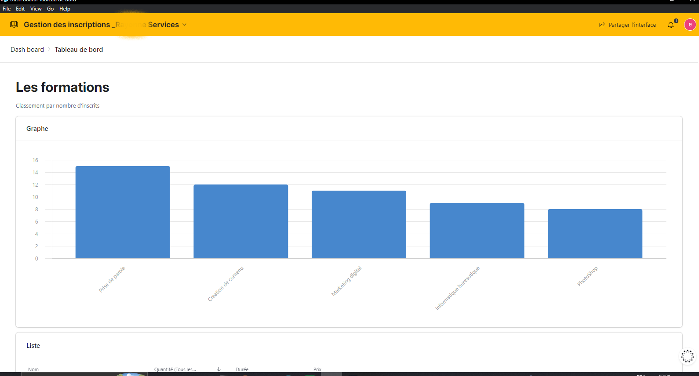
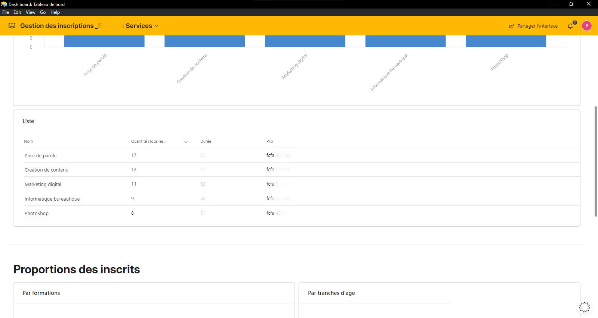
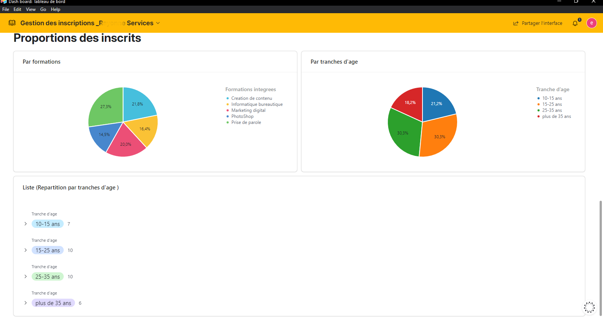
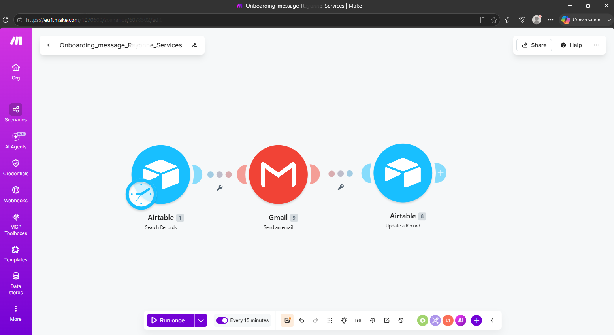

 🎓 Student Lifecycle & Data Analytics : Optimisation du Flux d'Inscription et organisation

## 🎯 Objectif du Projet
Automatiser l'intégralité du processus d'inscription des apprenants pour une entreprise de formation, tout en transformant les données collectées en outils de décision stratégique (Business Intelligence).

---

## ❌ Le Problème (Avant)
L'entreprise gérait un volume important de formations, mais son système était obsolète :
- **Saisie manuelle fastidieuse :** Chaque inscription devait être recopiée manuellement dans une base de données, entraînant des erreurs de saisie et une perte de temps considérable.
- **Angle mort stratégique :** Les données étaient stockées mais non exploitées. L'entreprise ne savait pas avec précision quelle formation était la plus demandée ni quel était le profil type de ses apprenants.
- **Lenteur administrative :** Le traitement des dossiers d'inscription prenait trop de temps, retardant l'accès des apprenants aux cours.

---

## ✅ La Solution (Après)
Mise en place d'un pipeline de données automatisé, de la capture à l'analyse.

### ⚙️ Le Workflow de Données
Le système a été structuré en trois étapes clés :

1. **Automatisation de l'Intake (Entrée) :**
   - Mise en place d'un formulaire d'inscription intelligent.
   - **Flux :** `Formulaire` ➔ `Base de données`.
   - Résultat : Enregistrement automatique des demandes après remplissage du formulaire.

2. **Automatisatin du LifeCycle :**
   - Automatisation de l'onboarding et de l'organisation des donnees
   - **Flux :** `Base de données` ➔ `Automatisation (Aitable Automation/Make)` ➔ `Base de données`
   - Résultat : Envoi automatique du mail d'onbording, ajout des donnes dans les tables requises, mises a jour des statuts "conditions", envoi automatique d'un mail de fin de formation.  
    

3. **Centralisation & Structuration :**
   - Création d'une base de données relationnelle organisée par :     
     - *Demandes* (Coordonnées et profil des demandeurs).
     - *Catalogue de Formations* (Description, prix, durée).
     - *Inscriptions* (Lien entre l'apprenant et la formation choisie).
     - *Anciens étudiants* (Informations et appréciations des apprenants ayant terminé leurs formations)

4. **Module d'Analyse (Business Intelligence) :**
   - Création d'un tableaux de bord (Dashboard) permettant de visualiser en temps réel :
     - **Le classement des formations les plus demandées.**
     - **La segmentation par tranches d'âge des apprenants.**
     

---

## 🛠️ Stack Technique
- **Capture de données :** [Airtable Forms]
- **Automatisation :** [Make.com/Airtable Automation]
- **Gestion de données & CRM :** [Airtable]
- **Analyse & Visualisation :** [Airtable Interfaces]

---

## 🚀 Impact & Valeur Ajoutée

| Indicateur | Avant l'automatisation  |Après l'automatisation |
| :--- | :--- | :--- |
| Saisie des données |  Manuelle & Chronophage | 100% Automatisée |
| Fiabilité des données |  Risque d'erreurs humaines | Précision absolue |
| Analyse stratégique | Intuition / Estimation | Décisions basées sur des données réelles|
| Optimisation de l'offre | Offre statique | Offre ajustée selon la demande réelle |

---

## Cartographie du processus:

*Process map*

---
## 🖼️ Aperçu du Système

*Data base (extrait de base de données):*

---

*Dashbord :*

---

---

---
*Workflow*

---

## 📩 Besoin d'optimiser vos processus de données ?
Je vous aide à transformer vos données brutes en leviers de croissance pour votre entreprise.

- **Calendly :** [Prendre rendez-vous pour un diagnostic](calendly.com/efficiencypot)

